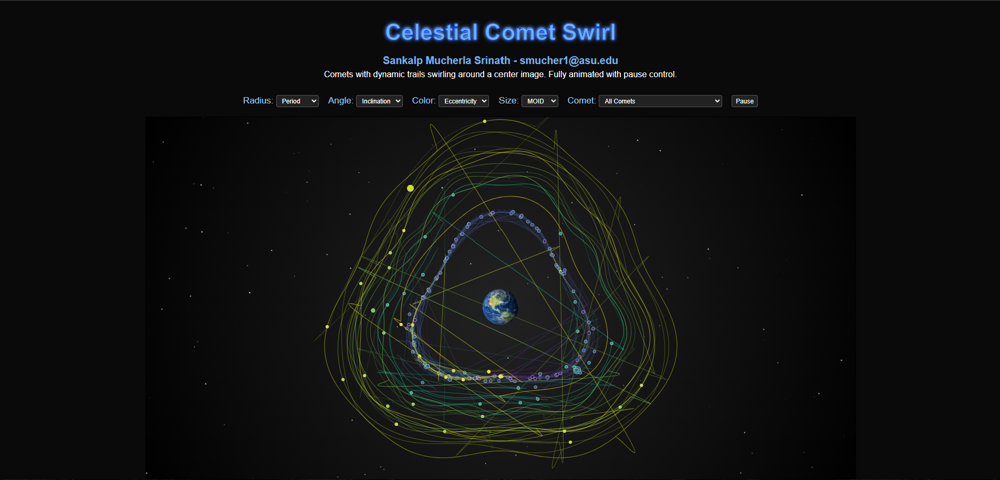

# ☄️ Celestial Design: Near-Earth Comet Visualization

An original **D3.js visualization** exploring the fascinating dataset of **Near-Earth Comets**, designed to move beyond conventional chart forms and embrace creative, data-driven storytelling.

---

## 🌌 Overview

This project visualizes attributes from NASA’s **Near-Earth Comets** dataset ([Kaggle Source](https://www.kaggle.com/datasets/nasa/near-earth-comets)) using a **custom-designed visualization**.  
It blends artistic and analytical elements to highlight key properties of comets that pass close to Earth — such as orbital characteristics, composition, and visibility.

---

## 🎯 Objectives

- Build a **unique D3-based visualization** that goes beyond standard charts.  
- Incorporate **at least three meaningful attributes** from the dataset.  
- Provide an insightful, aesthetically designed view of comet behavior and distribution.  
- Encourage exploration through creative design and interaction.

---

---

## 🧩 Data & Attributes

The dataset contains information about known **near-Earth comets**, including their orbital and physical properties.  
Your visualization should showcase at least **three of the following attributes** (or more if desired):

- **Comet Name**
- **Perihelion Distance (q)**
- **Aphelion Distance (Q)**
- **Orbital Period (years)**
- **Inclination (°)**
- **Eccentricity (e)**
- **Epoch or Discovery Year**
- **Diameter / Magnitude (if available)**

Derived or normalized attributes can also be created to enhance the narrative.

---

## 🪐 Visualization Design

Your exhibit should present the data in a **custom** visual format — not just a standard D3 chart.  
This could include novel compositions, glyphs, or hybrid chart structures. Examples of creative design directions:

- **Orbital Map:** Position comets based on orbital distance and inclination, using color to show eccentricity.
- **Comet Bloom (Glyph Design):** Represent each comet as a stylized “bloom” with petal length, angle, and color encoding different metrics.
- **Radial Arc View:** Use arcs to show orbital periods and gradients for speed or brightness.
- **Interactive Skyfield:** Scatter comets by position and animate trails to represent trajectories.

---

## 🧠 Design Documentation

### 🧱 Marks & Channels
- **Marks:** Circles, arcs, or custom shapes (glyphs or trails) representing comets.  
- **Channels:**  
  - **Position:** Orbital or spatial mapping  
  - **Color:** Attribute-based (e.g., eccentricity or inclination)  
  - **Size:** Relative scale for brightness or distance  
  - **Motion (optional):** Animated orbits or trails  

### 🧩 Category of Custom Visualization
Your project should fall under one of the following categories (choose and justify in your writeup):
- **Modded:** Adapted and restructured from an existing D3 example with significant changes.  
- **Combinatorial:** Merging multiple visualization types or techniques.  
- **Novel:** Entirely new form or layout, created from scratch.

Be sure to include a brief explanation (above or below the chart) describing your chosen marks, encodings, and why your work fits the selected category.

---

## 🧑‍🎨 Design & Creativity

You are encouraged to combine **artistic expression** with **data fidelity**. Use thoughtful colors, balance, and motion to reflect the data’s cosmic nature. Some inspiration sources include:

- [Lalettura](http://giorgialupi.com/lalettura)  
- [Film Flowers](http://sxywu.com/filmflowers/)  
- [Visualizing Painter’s Lives](http://giorgialupi.com/visualizing-painters-lives)  
- [Where the Wild Bees Are](https://www.scientificamerican.com/article/where-the-wild-bees-are/)  
- [OECD Better Life Index](http://www.oecdbetterlifeindex.org/#/31111111111)

---

## 📸 Output Example

Example placeholder:  

---

